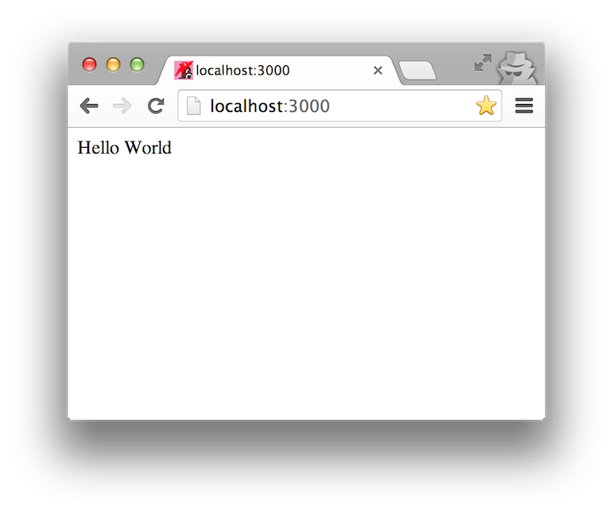

node.js Hello World Web App
=================


#Installing Node.js

    $ brew doctor
    $ brew install node

I already had node.js installed so:

    Error: node-0.10.21 already installed
    To install this version, first `brew unlink node'
    $ brew unlink node
    Unlinking /usr/local/Cellar/node/0.10.21... 1280 symlinks removed

Trying again

    $ brew install node
    ==> Downloading https://downloads.sf.net/project/machomebrew/Bottles/n...

#Installing npm

__npm__ : Node Package Manager

I was able to access npm directly after installing node, although some sites report
that a separate install is required

    $ npm -v
    1.4.11


#Creating our Project

In our projects directory:

    $ mkdir nodesayhello
    $ cd nodesayhello

Create a ```package.json``` file:

    {
      "name": "nodesayhello",
      "version": "0.0.1",
      "description" : "My first Node.js Web Application",
      "homepage" : "https://github.com/stujo/nodesayhello",
      "keywords" : ["hello world"],
      "author" : "Stujo https://github.com/stujo/",
      "main" : "nodesayhello.js",
    }

What is ```package.json```?

All npm (node package manager) package contain this file, it specifies the name and the ```main``` file
which will be run when the package is required


#MVP - Say Hello!

Create the file ```nodesayhello.js```:

    console.log('Hello World');

Run the file:

    $ node nodesayhello.js

    Hello World

#Setting up a Web Server

## Using Express

The express framework seems popular:

* [http://expressjs.com/](http://expressjs.com/)

Update the ```package.json``` file to depend on express:

    {
      "name": "nodesayhello",
      "version": "0.0.1",
      "description" : "My first Node.js Web Application",
      "homepage" : "https://github.com/stujo/nodesayhello",
      "keywords" : ["hello world"],
      "author" : "Stujo https://github.com/stujo/",
      "main" : "nodesayhello.js",
      "private": true,
      "dependencies": {
        "express": "3.x"
      }
    }


Install the new dependencies:

    $ npm install

Output:

    express@3.8.0 node_modules/express
    ├── parseurl@1.0.1
    ├── merge-descriptors@0.0.2
    ├── cookie@0.1.2
    ├── debug@0.8.1
    ├── cookie-signature@1.0.3
    ├── range-parser@1.0.0
    ├── fresh@0.2.2
    ├── methods@1.0.0
    ├── buffer-crc32@0.2.1
    ├── send@0.3.0 (debug@0.8.0, mime@1.2.11)
    ├── mkdirp@0.5.0 (minimist@0.0.8)
    ├── proxy-addr@1.0.0 (ipaddr.js@0.1.2)
    ├── commander@1.3.2 (keypress@0.1.0)
    └── connect@2.17.1 (response-time@1.0.0, method-override@1.0.1, connect-timeout@1.1.0, pause@0.0.1, vhost@1.0.0,
        qs@0.6.6, on-headers@0.0.0, basic-auth-connect@1.0.0, bytes@1.0.0, morgan@1.1.1, serve-favicon@2.0.0,
        errorhandler@1.0.1, serve-static@1.1.0, cookie-parser@1.1.0, type-is@1.2.0, body-parser@1.2.0,
        csurf@1.2.0, compression@1.0.2, express-session@1.2.0, serve-index@1.0.3, multiparty@2.2.0)

This also creates the folder ```node_modules``` in the project

Question: Should I add ```node_modules``` to ```.gitignore```

https://www.npmjs.org/doc/faq.html#Should-I-check-my-node_modules-folder-into-git

So __NO__ not for our web app, we should check in the dependencies

#Git

At this point, it's time for me to setup git

    $ git init
    $ git add .
    $ git commit -m'First Pass, express installed but not used'


#A Simple Web Server

Time to update ```nodesayhello.js```:

    console.log('Hello World Loading');

    var PORT_NUMBER = 3000;
    if (process.env.PORT) {
      PORT_NUMBER = parseInt(process.env.PORT);
    }

    // Load Express Module
    var express = require('express');

    // Create the App
    var app = express();


    // Set up root route
    app.get('/', function (req, res) {
      res.send('Hello World');
    });

    // Start the Server
    var server = app.listen(PORT_NUMBER, function () {
      console.log('Listening on port %d', server.address().port);
    });

#Run it!



Yeay!

#Static Files

Adding a static server from the public folder (which serves from / not /public)

    console.log('Hello World Loading');

    var PORT_NUMBER = 3000;
    if (process.env.PORT) {
      PORT_NUMBER = parseInt(process.env.PORT);
    }

    // Load Express Module
    var express = require('express');

    // Create the App
    var app = express();

    var img_path = "nodesayhello.png";

    // Set up root route
    app.get('/', function (req, res) {
      res.set('Content-Type', 'text/html');
      res.send(200, '<html><body>Hello World </body></html>');
    });


    // Serve Static Files from public folder
    app.use(express.static(__dirname + '/public'));

    // Start the Server
    var server = app.listen(PORT_NUMBER, function () {
      console.log('Listening on port %d', server.address().port);
    });


#Heroku

##Git Branch for experiments

    $ git checkout -b heroku_deployable

##Update package.json

Update ```package.json``` with:

    $ npm install express logfmt --save

Add ```engines```

    "engines": {
      "node": "0.10.x"
    }

To give us:

    {
      "name": "nodesayhello",
      "version": "0.0.1",
      "description": "My first Node.js Web Application",
      "homepage": "https://github.com/stujo/nodesayhello",
      "keywords": [
        "hello world"
      ],
      "author": "Stujo https://github.com/stujo/",
      "main": "nodesayhello.js",
      "private": true,
      "dependencies": {
        "express": "^3.8.0",
        "logfmt": "^1.1.2"
      },
      "engines": {
        "node": "0.10.x"
      }
    }

##Add Procfile

Add ```Procfile```:

    web: node nodesayhello.js

##Test Locally

    $ foreman start

    12:31:24 web.1  | started with pid 53657
    12:31:24 web.1  | Hello World Loading
    12:31:24 web.1  | Listening on port 5000

Yeay! (Note default port of 5000)

    $export PORT=6000

    $foreman start
    12:33:33 web.1  | started with pid 53760
    12:33:33 web.1  | Hello World Loading
    12:33:33 web.1  | Listening on port 6000

Yeay! Able to set port

##Create the App

    $ heroku apps:create nodesayhello

##Deploy Heroku Testing Branch

    $ git push heroku heroku_deployable:master

##View the Test

Browse to:

* http://nodesayhello.herokuapp.com/


Yeay!

##Commit the heroku changes to master

    $ git add .
    $ git commit -m'Adding Heroku Screenshot'
    $ git checkout master
    $ git merge heroku_deployable

#Deploy master to Heroku

    $ git push heroku master


Yeay!


#Heroku's Recommended Node Habits:

Let's take a look at this:

* [https://blog.heroku.com/archives/2014/3/11/node-habits](https://blog.heroku.com/archives/2014/3/11/node-habits)

##npm start

Adding a start script to our ```package.json```

    "scripts": {
        "start": "node nodesayhello.js"
    }

Allows us to start the app like this:

    $ npm start

##node_modules revisited!

Hmm!

* [https://blog.heroku.com/archives/2014/3/11/node-habits#5-keep-dependencies-out-of-source-control](https://blog.heroku.com/archives/2014/3/11/node-habits#5-keep-dependencies-out-of-source-control)

Maybe now the advice is NOT to include node_modules in git?

I guess this depends, so let's try removing node_modules from git and seeing what happens

    $ echo node_modules >> .gitignore
    $ git rm -r --cached node_modules
    $ git add --all
    $ git commit -m 'Remove the now ignored directory "node_modules"'
    $ git push heroku master

and...Seems to still work :)

##npm outdated

Running

    $ npm outdated

Gives:

    Package  Current  Wanted  Latest  Location
    express    3.8.0   3.8.0   4.3.0  express
    split     0.2.10  0.2.10   0.3.0  logfmt > split

I'm not using logfmt so removed that from ```package.json```

I can upgrade express so I changed ```package.json``` to

    "dependencies": {
        "express": "4.3.0"
    },

Not entirely sure here:

    $npm install
    $npm update
